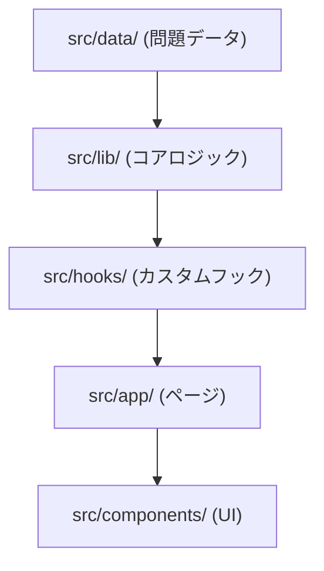

# CLAUDE.md

This file provides guidance to Claude Code (claude.ai/code) when working with code in this repository.

## プロジェクト概要

小学 1〜3 年生向けの漢字・算数学習 Web アプリ（きっずらぼ）。Next.js App Router + TypeScript + Tailwind CSS v4 で構築。アカウント不要で localStorage に進捗を保存する完全スタンドアロン構成。

## コマンド

```bash
npm run dev      # 開発サーバー起動 (localhost:3000)
npm run build    # 本番ビルド
npm run lint     # ESLint 検査
```

テストフレームワークは現在未導入。

## パスエイリアス

`@/*` → `src/*`（tsconfig の paths 設定）

## アーキテクチャ

### ルーティング構造

App Router で学習フローを階層化する。

```
/                               → 学年選択
/grade/[grade]/                 → 教科選択 (漢字 / 算数)
/grade/[grade]/kanji/           → 漢字モード選択
/grade/[grade]/kanji/fill       → 穴あき問題
/grade/[grade]/kanji/choice     → 4 択問題
/grade/[grade]/math/            → 算数モード選択
/grade/[grade]/math/calc        → 計算問題
/grade/[grade]/math/word        → 文章題
/grade/[grade]/math/unit-test   → 単元別テスト
/grade/[grade]/math/summary-test → まとめテスト
/progress/                      → 成績確認
```

### データフロー



- `src/data/` — 静的問題データ。漢字は学年別 TS ファイル、算数は動的ジェネレータ関数。
- `src/lib/` — 適応学習・スコア計算・localStorage 操作のコアロジック。
- `src/hooks/` — ページが使うカスタムフック（セッション管理・進捗管理）。
- `src/components/` — UI コンポーネント。`ui/`, `layout/`, `problem/`, `feedback/` に分類。

### 適応学習エンジン (`src/lib/adaptive.ts`)

Leitner 法ベース。習熟度は `new → learning → developing → mastered` の 4 段階で遷移する。最終回答から 3 日以上経過した `mastered` 問題は `review` へ戻る。

10 問セッションの出題配分は `new=2, learning=4, developing=2, mastered=1, review=1`。

### 永続化 (`src/lib/storage.ts`)

localStorage キー `kid-lab:progress` に学年ごとの `UserProgress` オブジェクトを JSON 保存する。セッション履歴は最新 100 件を保持する。

### 型定義 (`src/types/`)

- `problem.ts` — `KanjiProblem` (fill / choice) と `MathProblem` (calc / word)
- `progress.ts` — `UserProgress`, `TopicMastery`, `SessionRecord`, バッジ定義
- `common.ts` — `GradeTheme`（学年別テーマカラー）

## プロジェクト規則

- ブランチ名は `main` を使用（`master` 不使用）
- コミットメッセージは日本語
- Bash コマンドは `&&` や `|` で連結せず、個別の呼び出しに分ける
- パイプが必要な場合は `.tmp/` 配下の一時ファイルに出力し、Read ツールで読む
- `git -C` は使わず `cd` を使う
